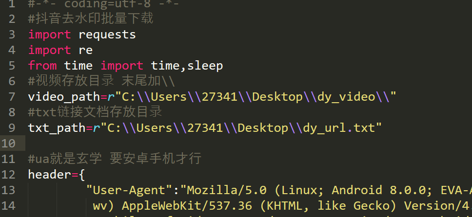
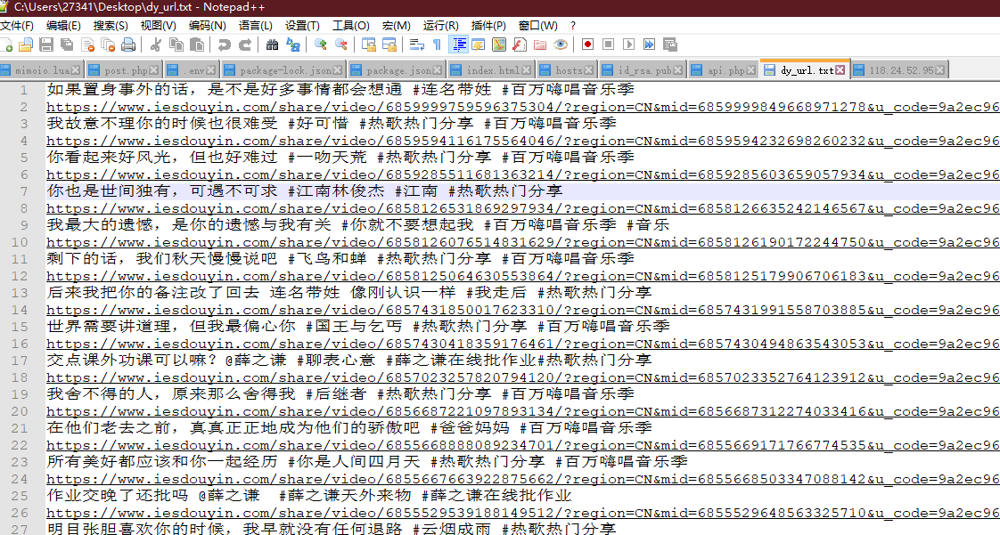
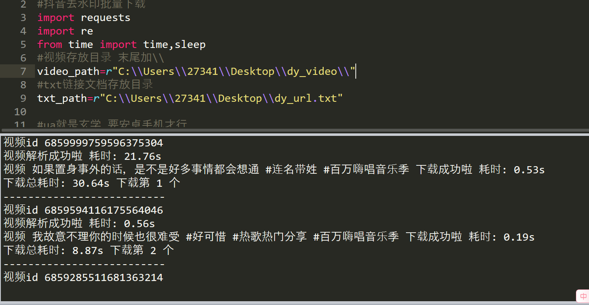
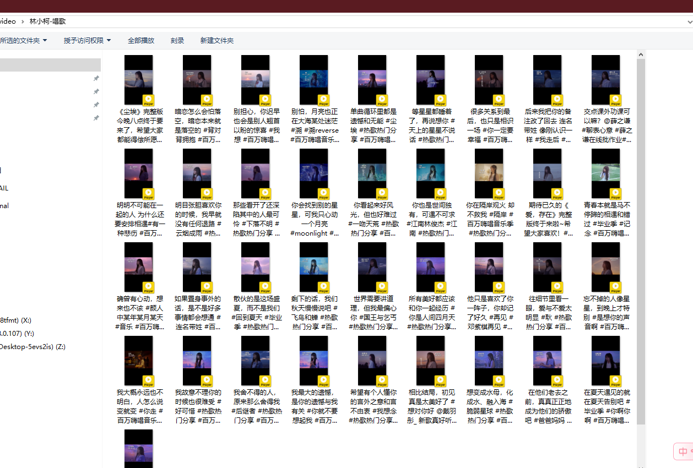
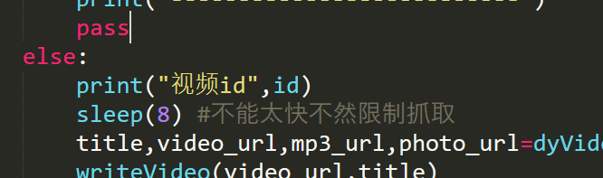
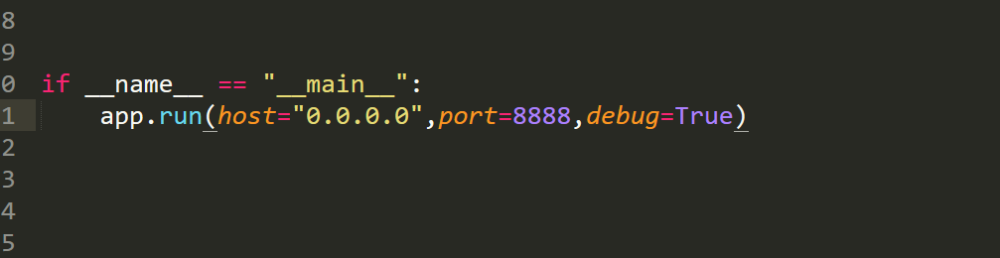
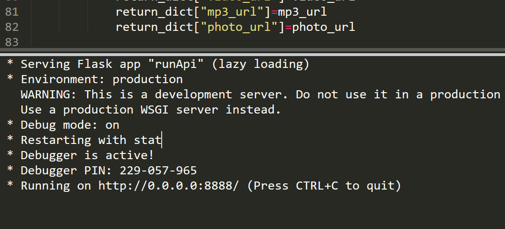
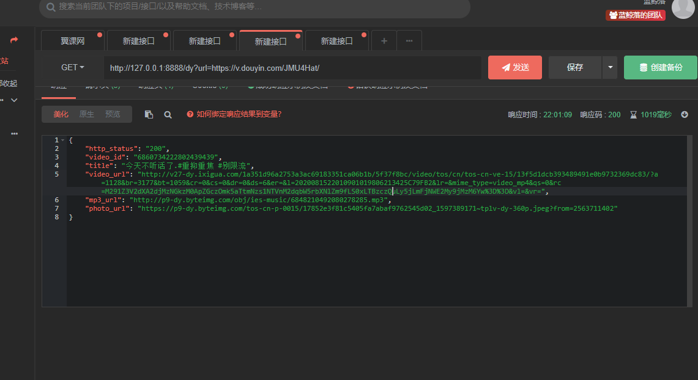
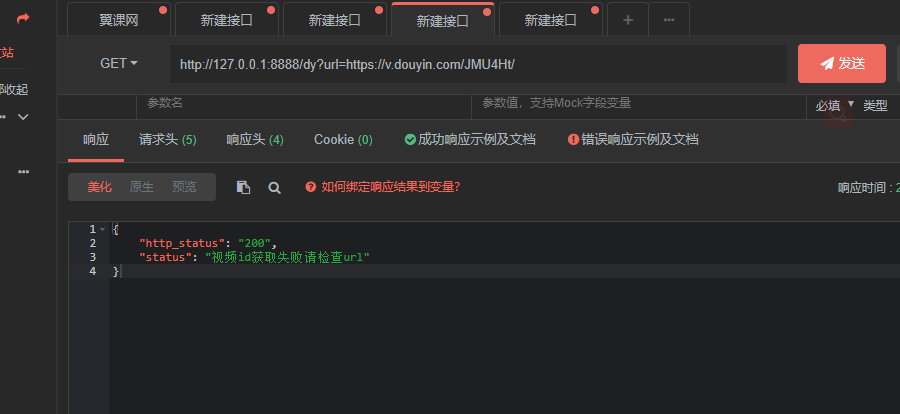
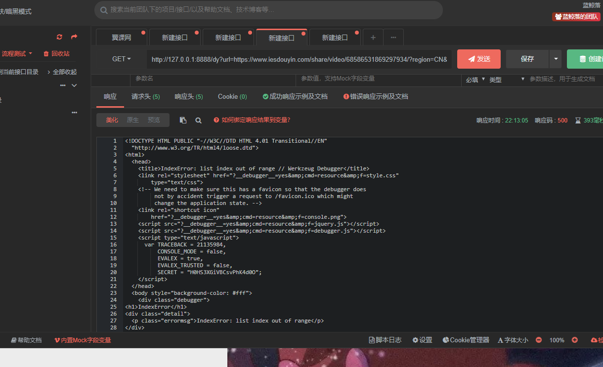

# Python抖音去水印批量下载（提供api对接）

## 前言

- 本人才是**14岁的初中生**，暑假期间**自学Python**，程序可能会**存在少许bugs**。欢迎各位大佬提出**lssure**🙋指导一下**小萌新**😘
- 也十分欢迎大家再次**完善修改源码**，源码都写了**十分详细的注释**，也供**初学者参考**💯
- 其实**原理超级简单**，有兴趣不妨**bing google** ~~baidu~~ 一下
- 提供详细的教程，即使对**编程一点了解**也没有的小白白/女孩纸也可使用丫🤣
- 如果喜欢并想鼓励一下**卑微的我**，给颗**star** **fork**也是可以哒 **我会很开心哒**😘

## 环境搭建

### 1. **Python 3.X**以上的环境 推荐`Python3.7`

- **不是叭 不是叭**  都0202年了，还有人用Python2.X？？😥
- **安装详细过程请自行bing**

## 2.安装所需要的第三方库

- pip慢的可以bing `pip更换国内源`

- 打开**termux**或者**cmd** 运行:

  - **使用Linux的小可爱需要用root用户执行丫**😁

  ```
  pip install requests
  pip install flask
  ```


## 运行方法

- 打开主程序 **dyDelWm.py** 修改 **下载视频存放目录**(video_path) **txt链接文档存放目录**(txt.path)



> **敲黑板**：使用**Linux**的小可爱需要将  **\\\改成/*

- **txt链接文件**

  > 这十分**方便且快捷** 直接在**抖音App复制链接**到txt文档就行了 支持**短链接和长链接**
  >
  > 但是要保证**1行内最多有1个链接**

  - **项目中的dy_url文件提供参考**☑

  

- 运行 **dyDelWm.py**

  - **Linux** 小可爱 **texmux输入**:

    ```shell
    chmod 777 dyDelWm.py
    python3 dyDelWm.py
    ```

  > 使用 **Linux** 上一步所填写的路径必须有**可读可写**权限！

  - **Windows** 小可爱

    选择 打开.py文件的方式

    

    



#### 文件名称默认是：**视频文案.mp4**

#### 因为抖音爸爸有反扒检查，我把获取视频无水印链接的时间间隔8s，需要修改请在 `dyDelWm.py`中的第95行 `sleep(8)` 修改



## 搭建API方法

### 考虑到大家在用自己喜欢的语言开发，网上的抖音去水印解析api都没有几个可以用的。还不如自己用Python的`flask`模块写了个api😋(阿巴......阿巴......)

> 没系统学过**flask** 开发出来的东西 咳咳咳。。。
>
> 也希望大佬可以再次把**api部分完善**

### 1.运行`runApi.py`

> 可以在`runapi.py` 第91行自定义运行的端口号





> 不出意外的话。。。

### 2.api请求方式

#### 请求🙇

##### 方式：get

|  参数  |                内容                |
| :----: | :--------------------------------: |
|  url   | 抖音分享链接（支持长链接和短链接） |

示例：

[http://127.0.0.1:8888/dy?url=https://v.douyin.com/JMU4Hat/](http://127.0.0.1:8888/dy?url=https://v.douyin.com/JMU4Hat/)

#### 返回

##### 格式：json

|    参数     |          内容          |
| :---------: | :--------------------: |
| http_status | http状态码 成功则为200 |
|  video_id   |         视频id         |
|    title    |     视频文案/标题      |
|  video_url  |     视频无水印直链     |
|   mp3_url   |      视频音乐链接      |
|  photo_url  |       视频封面图       |



##### 异常时候处理😵



##### bug部分😭

> 出现于**长链接** 获取错误id后继续执行了下去，并没有**返回错误**



## 后☺

**喜欢的话点个star再走呀**